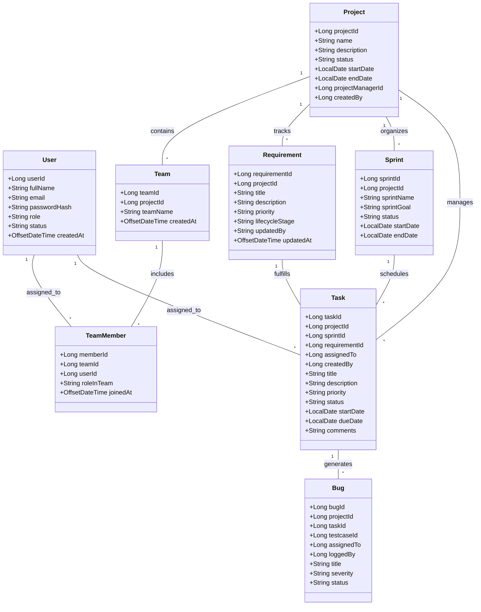
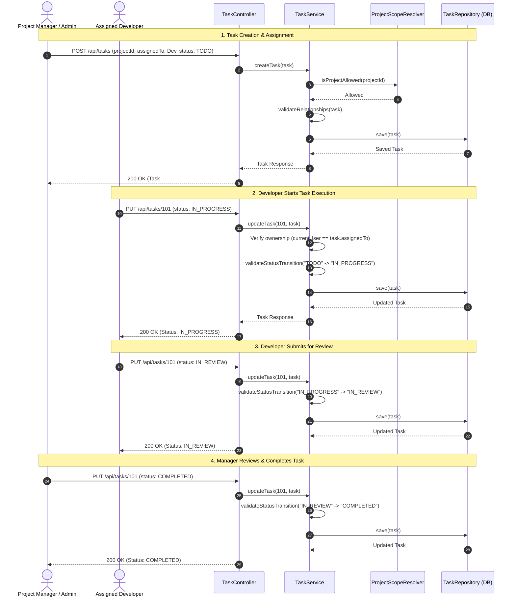
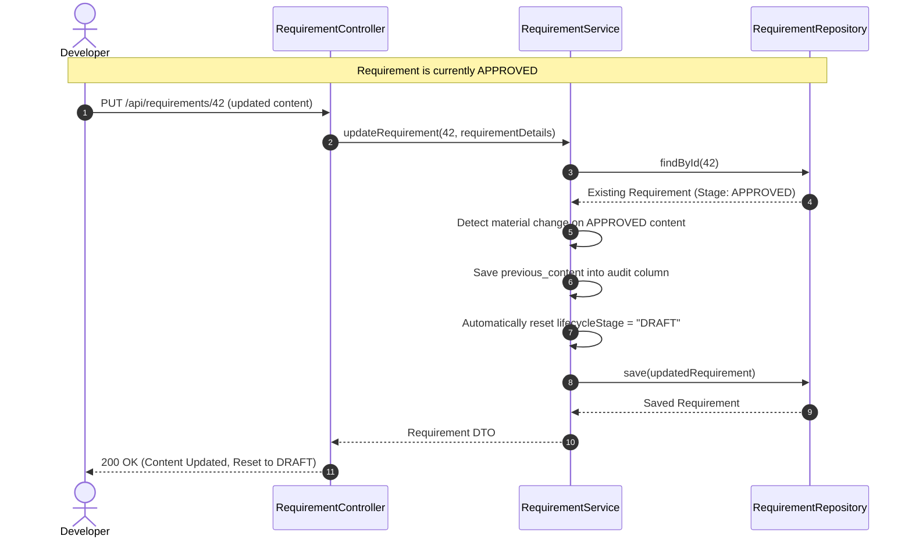
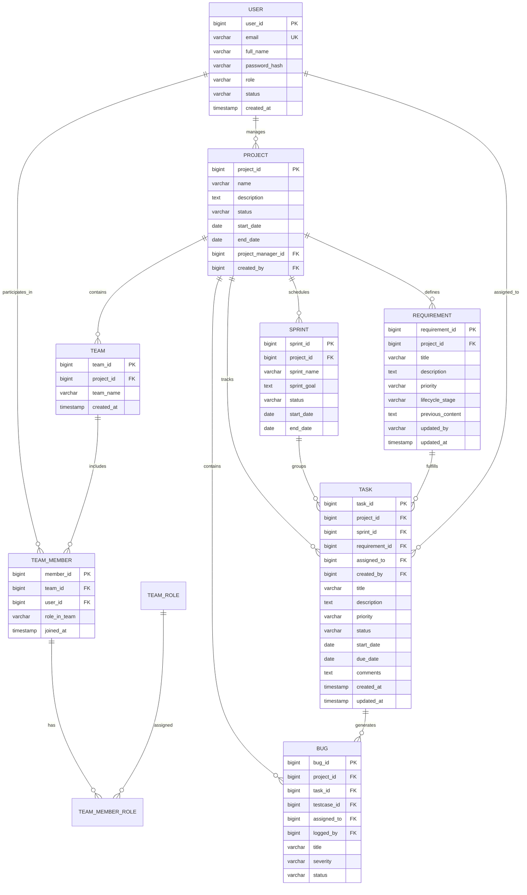

# NeuroForge UML Architecture & Design Specifications

This document contains comprehensive UML diagrams and architectural specifications for the **NeuroForge Enterprise SDLC Platform**. All diagrams are formatted using standard GitHub-Flavored Markdown Mermaid syntax.

---

## 1. System Component & Layer Architecture

```mermaid
graph TD
    Client[React SPA Frontend - Vite + Bootstrap]
    
    subgraph Security Layer
        Filter[JwtRequestFilter]
        AuthManager[AuthenticationManager]
        ScopeResolver[ProjectScopeResolver]
    end

    subgraph REST Controllers
        AuthCtrl[AuthController]
        UserCtrl[UserController]
        ProjCtrl[ProjectController]
        TeamCtrl[TeamController]
        ReqCtrl[RequirementController]
        SprintCtrl[SprintController]
        TaskCtrl[TaskController]
        BugCtrl[BugController]
    end

    subgraph Service Layer
        AuthSvc[AuthService]
        UserSvc[UserService]
        ProjSvc[ProjectService]
        TeamSvc[TeamService]
        ReqSvc[RequirementService]
        SprintSvc[SprintService]
        TaskSvc[TaskService]
        BugSvc[BugService]
        LogSvc[SystemLogService]
    end

    subgraph Persistence Layer JPA Repositories
        UserRepo[UserRepository]
        ProjRepo[ProjectRepository]
        TeamRepo[TeamRepository]
        TeamMemberRepo[TeamMemberRepository]
        ReqRepo[RequirementRepository]
        SprintRepo[SprintRepository]
        TaskRepo[TaskRepository]
        BugRepo[BugRepository]
    end

    Database[(Database - Supabase PostgreSQL / H2)]

    Client --> AuthCtrl
    Client --> UserCtrl
    Client --> ProjCtrl
    Client --> TeamCtrl
    Client --> ReqCtrl
    Client --> SprintCtrl
    Client --> TaskCtrl
    Client --> BugCtrl

    AuthCtrl --> AuthSvc
    UserCtrl --> UserSvc
    ProjCtrl --> ProjSvc
    TeamCtrl --> TeamSvc
    ReqCtrl --> ReqSvc
    SprintCtrl --> SprintSvc
    TaskCtrl --> TaskSvc
    BugCtrl --> BugSvc

    ProjSvc --> ScopeResolver
    TaskSvc --> ScopeResolver
    TaskSvc --> LogSvc
    ReqSvc --> LogSvc

    UserSvc --> UserRepo
    ProjSvc --> ProjRepo
    ProjSvc --> TeamRepo
    ProjSvc --> TeamMemberRepo
    ReqSvc --> ReqRepo
    SprintSvc --> SprintRepo
    TaskSvc --> TaskRepo
    BugSvc --> BugRepo

    UserRepo --> Database
    ProjRepo --> Database
    TeamRepo --> Database
    TeamMemberRepo --> Database
    ReqRepo --> Database
    SprintRepo --> Database
    TaskRepo --> Database
    BugRepo --> Database
```



---

## 2. System Use Case Diagram

```mermaid
usecaseDiagram
    actor Admin as "System Administrator"
    actor PM as "Project Manager"
    actor Dev as "Developer"
    actor Tester as "QA / Tester"

    package "NeuroForge SDLC Management System" {
        usecase UC1 as "Manage System Users & Onboarding"
        usecase UC2 as "Create & Manage Projects"
        usecase UC3 as "Onboard Team Members & Assign Roles"
        usecase UC4 as "Create & Approve Requirements"
        usecase UC5 as "Mark Requirement Implemented"
        usecase UC6 as "Verify Requirement Implementation"
        usecase UC7 as "Plan & Activate Sprints"
        usecase UC8 as "Create & Assign Tasks"
        usecase UC9 as "Execute & Transition Assigned Tasks"
        usecase UC10 as "Review & Complete Tasks"
        usecase UC11 as "Report & Verify Bugs"
    }

    Admin --> UC1
    Admin --> UC2
    Admin --> UC3
    Admin --> UC4
    Admin --> UC7
    Admin --> UC8
    Admin --> UC10

    PM --> UC2
    PM --> UC3
    PM --> UC4
    PM --> UC7
    PM --> UC8
    PM --> UC10

    Dev --> UC5
    Dev --> UC9
    Dev --> UC11

    Tester --> UC6
    Tester --> UC9
    Tester --> UC11
```

---

## 3. Domain Entity Class Diagram



---

## 4. Sequence Diagram: Task Lifecycle & Assignment Execution



---

## 5. Sequence Diagram: Requirement Edit & Reset Workflow



---

## 6. Entity Relationship Diagram (ERD)


